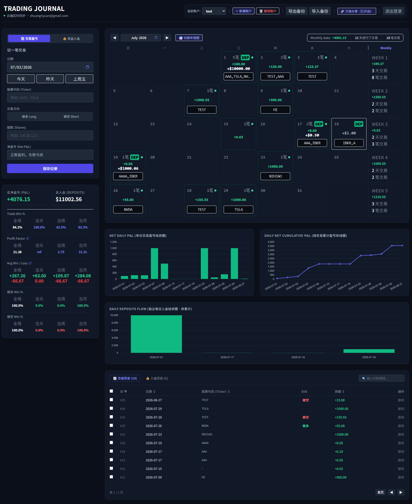
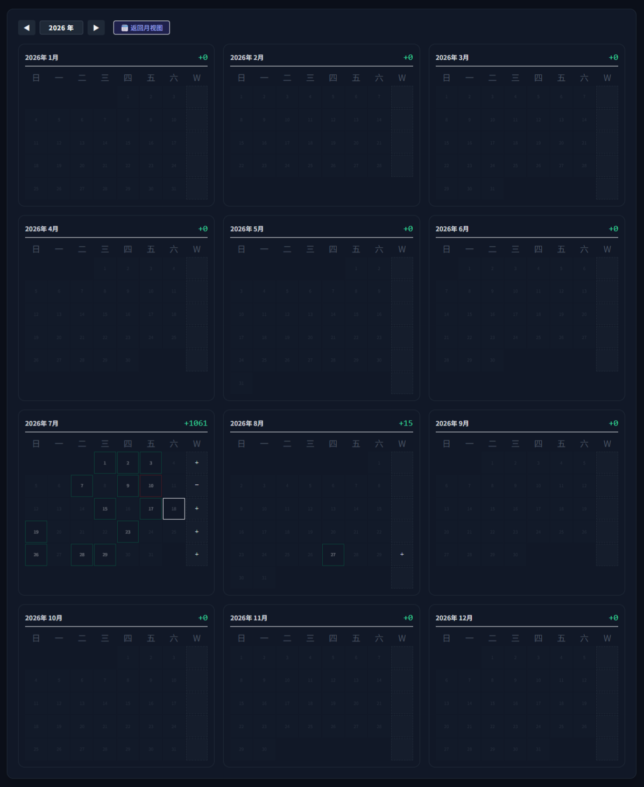
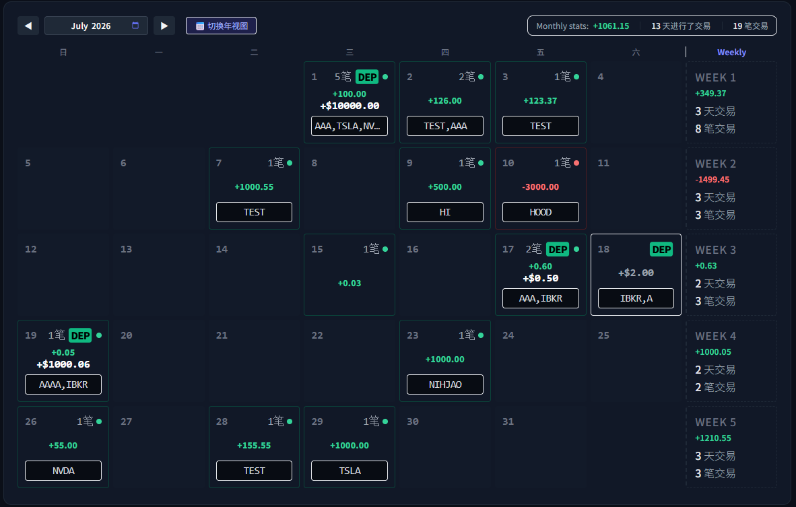
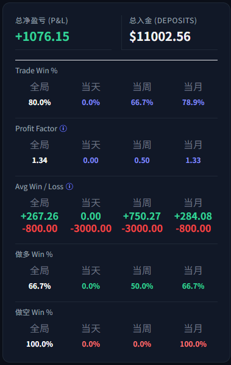
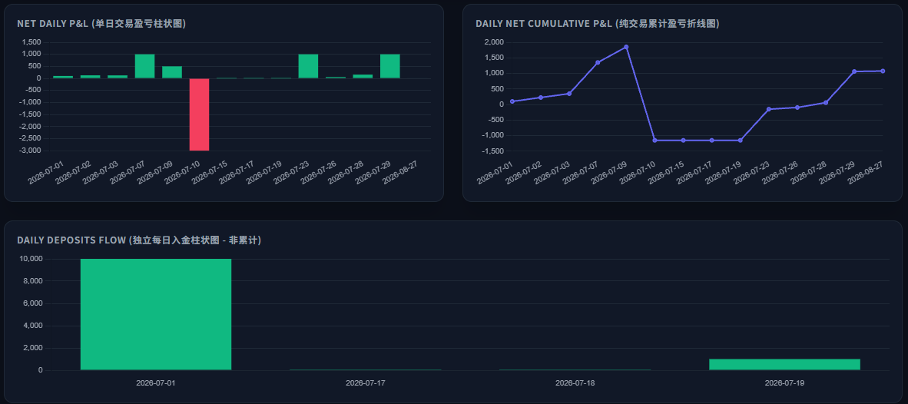
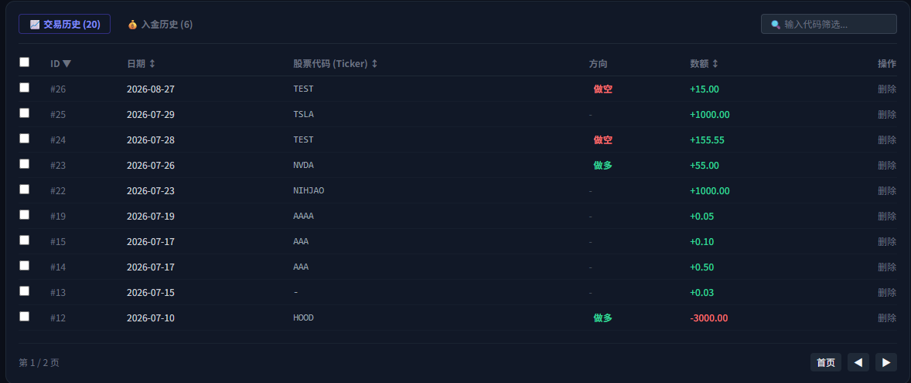

# Trading Journal (多账户交易日志)

一个纯前端、无需后端服务器的交易日志 App。用邮箱验证码登录，数据实时同步到 [InstantDB](https://instantdb.com)（多设备共享同一份数据），支持多账户、日历盈亏视图、图表统计、只读分享链接，并可作为 PWA 添加到手机主屏幕，或用 Electron 打包成桌面 App。

## 截图

**整体界面**（月视图日历 + 统计面板 + 图表 + 交易历史）



<details>
<summary>更多截图（点击展开）</summary>

<br>

**年视图日历** —— 一年 12 个月的盈亏概览，点进某个月自动跳转到月视图



**月视图日历** —— 每天的盈亏 / 入金一目了然，右侧是每周汇总，点击某天可查看当天交易明细



**统计面板** —— 总盈亏、总入金、Trade Win %、Profit Factor、Avg Win/Loss，以及做多 / 做空胜率，全部按全局 / 当天 / 当周 / 当月拆分



**图表** —— 每日盈亏柱状图、累计盈亏曲线、每日入金柱状图



**交易历史** —— 可搜索、排序、分页、批量删除，做多 / 做空方向一目了然



</details>

## 功能

- **邮箱验证码登录**，数据云端实时同步（电脑/手机自动同步，不依赖本地存储）
- **多账户管理**：新建 / 切换 / 删除账户，每个账户的交易和入金记录互相独立
- **日历视图**：按月/按年查看每日盈亏，点击某天可查看当天所有交易明细；手机端有单独优化过的紧凑布局
- **统计面板**：总盈亏、总入金、胜率、Profit Factor、平均盈亏（按全局/当天/当周/当月拆分）
- **图表**：每日盈亏柱状图、累计盈亏曲线、每日入金柱状图
- **交易 / 入金历史表格**：搜索、排序、分页、批量删除
- **只读分享链接**：生成一个 `?share=TOKEN` 链接，对方无需登录即可查看你的账户（日历、统计、图表、历史记录都能看），但看不到、也碰不了任何编辑功能
- **导出 / 导入备份**：JSON 格式，跨设备迁移或本地留档
- **PWA**：支持"添加到主屏幕"，有独立图标和启动主题色
- **Electron 友好**：全局隐藏了滚动条，打包成桌面 App 后不会露出网页感的滚动条

## 技术栈

不需要任何构建工具，全部通过 CDN 引入，`index.html` 单文件即可运行：

- [Vue 3](https://vuejs.org/)（`vue.global.prod.min.js`）
- [Tailwind CSS](https://tailwindcss.com/)（CDN 版）
- [Chart.js](https://www.chartjs.org/)
- [InstantDB](https://instantdb.com)（`@instantdb/core`，实时数据库 + 邮箱验证码登录）

## 目录结构

```
.
├── index.html                       App 主文件（唯一必须的文件）
├── manifest.json                    PWA 配置（"添加到主屏幕"用）
├── icons/
│   ├── favicon-32.png               浏览器标签页图标
│   ├── icon-192.png                 PWA / Android 主屏幕图标
│   ├── icon-512.png                 PWA 高清图标 / 生成 logo-full.png 的素材
│   └── apple-touch-icon.png         iOS 主屏幕图标（180×180，不透明背景）
├── logo-full.png                    完整版 Logo（图形 + "TRADING JOURNAL" 字样），用于 README / 官网 / 启动页，不用于小尺寸图标
├── screenshots/
│   ├── overview.png                  整体界面（月视图 + 统计 + 图表 + 历史）
│   ├── calendar-year.png             年视图日历
│   ├── calendar-month.png            月视图日历
│   ├── stats.png                     统计面板
│   ├── charts.png                    图表
│   └── history.png                   交易历史表格
└── instantdb-permissions-setup.md   InstantDB 后台需要粘贴的权限规则说明
```

## 别人 Fork / 下载这个仓库后要怎么搭建

这个 App 除了代码之外，还依赖你自己的 InstantDB 账号（数据库 + 登录）。别人拿到代码后，跟着下面几步走，几分钟就能有一份完全独立、数据互不干扰的自己的版本。

### 1. 注册 InstantDB，拿到自己的 APP_ID

去 [instantdb.com/dash](https://instantdb.com/dash) 免费注册，新建一个 App，拿到 `APP_ID`，替换掉 `index.html` 里的这一行：

```js
const APP_ID = 'c39b06a1-34be-46b6-9d7e-f306be9b7682';
```

### 2. 配置权限规则（Permissions）—— 这一步最容易漏

InstantDB 后台 → 你的 App → **Permissions**，粘贴以下规则（`instantdb-permissions-setup.md` 里也有完整版，包含每张表的详细说明）：

```json
{
  "attrs": {
    "allow": { "$default": "false" }
  },
  "$users": {
    "allow": {
      "create": "data.email in ['你自己的邮箱@example.com']"
    }
  },
  "records": {
    "bind": ["isOwner", "auth.id != null && auth.id == data.ownerId"],
    "allow": {
      "view": "isOwner || (ruleParams.shareToken != null && ruleParams.shareToken == data.shareToken)",
      "create": "auth.id != null && auth.id == data.ownerId",
      "delete": "isOwner",
      "update": "isOwner"
    }
  },
  "accounts": {
    "bind": ["isOwner", "auth.id != null && auth.id == data.ownerId"],
    "allow": {
      "view": "isOwner || (ruleParams.shareToken != null && ruleParams.shareToken == data.shareToken)",
      "create": "auth.id != null && auth.id == data.ownerId",
      "delete": "isOwner",
      "update": "isOwner"
    }
  },
  "dayNotes": {
    "bind": ["isOwner", "auth.id != null && auth.id == data.ownerId"],
    "allow": {
      "view": "isOwner || (ruleParams.shareToken != null && ruleParams.shareToken == data.shareToken)",
      "create": "auth.id != null && auth.id == data.ownerId",
      "delete": "isOwner",
      "update": "isOwner"
    }
  }
}
```

⚠️ **最容易漏掉的一步**：`$users` 那段 `data.email in [...]` 是一个"登录白名单"——只有列在里面的邮箱才能注册/登录。**必须把方括号里的邮箱换成自己的**，不然验证码能收到，但会被拒绝登录，个人邮箱一定要填对。如果想让任何人都能登录（比如做成公开工具），把这行整个删掉，只保留 `"allow": {}`（或者干脆删掉整个 `$users` 这段，用 InstantDB 默认行为）。

### 3. 在 Explorer 里手动建好表和字段

因为上面 `"attrs": { "allow": { "$default": "false" } }` 这条规则锁死了"自动创建新字段"，第一次用某些功能之前，需要去 Dashboard 的 **Explorer** 手动建好下面这些表和字段（类型都选 `string`/`number`，不要勾 required）：

| 表 | 字段 | 类型 |
|---|---|---|
| `accounts` | `shareToken` | string |
| `records` | `shareToken`、`direction`、`shares` | string / string / number |
| `dayNotes` | `ownerId`、`accountId`、`date`、`content`、`updatedAt`、`shareToken` | string / string / string / string / number / string |

不建也不影响基本记账功能，但对应的"只读分享"、"做多/做空"、"日历笔记"这几个功能会在写入时报权限错误。

### 4. 打开 App，正常使用

首次打开会要求邮箱验证码登录（用第 2 步白名单里填的邮箱），登录后会自动建一个"默认账户"，之后就是正常用了。

## 本地运行 / 部署

**本地**：直接双击打开 `index.html` 即可（`file://` 协议下大部分功能正常，但"只读分享链接"生成的地址会是 `file://...`，只有你自己电脑能打开）。

**部署到 GitHub Pages / 任意静态网站托管**：把整个文件夹（`index.html`、`manifest.json`、`icons/`、`logo-full.png`）原样上传，保持相对路径不变即可，不需要任何构建步骤。部署到真实域名后，"只读分享链接"会自动变成对方也能打开的 `https://...` 地址。

**打包成 Electron 桌面 App**：把 `index.html` 作为 `BrowserWindow` 加载的页面即可；应用图标（任务栏/Dock）需要在 Electron 的打包配置（如 `electron-builder` 的 `icon` 字段）里单独指定，`favicon`/`apple-touch-icon` 这些网页 meta 标签不会影响它。

## 关于图标缓存

浏览器对 favicon 的缓存非常顽固，换图标后如果标签页没更新，强制刷新（`Ctrl+Shift+R` / `Cmd+Shift+R`）通常就够了；如果还不行，去 `index.html` 里把图标链接后面的 `?v=9` 改成 `?v=10`（`manifest.json` 里对应的也要改），强制浏览器当成新文件重新拉取。

## 已知限制 / 待验证事项

- **只读分享的 `ruleParams` 调用方式**是参照 InstantDB 官方文档（目前只给了 React 版 `useQuery(query, { ruleParams })` 的例子）推断出的纯 JS/CDN 版本写法 `db.subscribeQuery(query, callback, { ruleParams })`，未在真实网络环境下跑通验证过。如果打开分享链接后浏览器控制台报错，欢迎带着报错信息反馈。
- iOS 的 `apple-touch-icon` 官方不建议使用透明背景，目前用的是不透明深色背景版本，这个是特意处理过的，不用再改。
- 所有数据结构都是 InstantDB 的 schemaless 模式（没有用 `instant.schema.ts` 定义正式 schema），字段是"用到才创建"，如果后台开了 `attrs` 锁定，加新字段前需要按上面第 3 步手动处理。
- 日历笔记的富文本编辑器用的是浏览器原生 `contenteditable` + `execCommand`（没有引入第三方库），支持加粗/斜体/下划线/列表，不支持图片。
